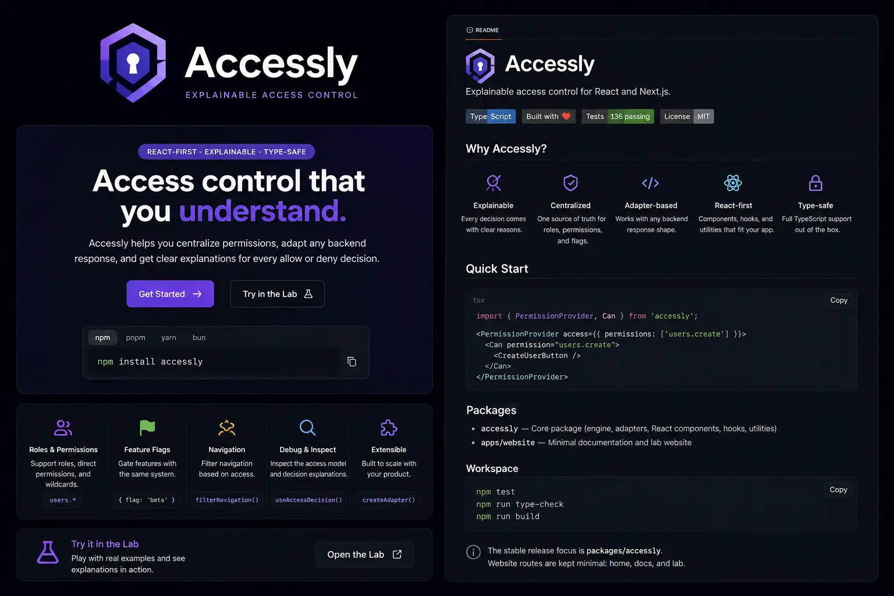

<p align="center">
  
</p>

# Accessly

Explainable access control for React.

Accessly provides permission components, hooks, backend adapters, navigation filtering, and inspectable allow/deny decisions for React applications.

## Installation

Default:

```bash
npm install accessly
```

Other package managers:

```bash
pnpm add accessly
yarn add accessly
bun add accessly
```

## Quick Start

```tsx
import { PermissionProvider, Can } from "accessly";

export function App() {
  return (
    <PermissionProvider
      access={{
        permissions: ["users.create"],
      }}
    >
      <Can permission="users.create">
        <button>Create user</button>
      </Can>
    </PermissionProvider>
  );
}
```

## Access Model

Accessly reads a normalized access model:

```ts
type AccessModel = {
  user?: {
    id?: string;
    roles?: string[];
    attributes?: Record<string, unknown>;
  };
  permissions?: string[];
  flags?: string[];
  navigation?: NavigationItem[];
  isLoading?: boolean;
};
```

## PermissionProvider

```tsx
import { PermissionProvider } from "accessly";

<PermissionProvider
  access={{
    user: { id: "user_1", roles: ["admin"] },
    permissions: ["users.create", "reports.view"],
    flags: ["beta.dashboard"],
  }}
>
  <App />
</PermissionProvider>;
```

## Backend Adapters

Use `createAdapter` to normalize your backend response into an Accessly access model.

```tsx
import { PermissionProvider, createAdapter } from "accessly";

type BackendUser = {
  id: string;
  roles: string[];
  perms: string[];
  flags: string[];
};

const adapter = createAdapter((source: BackendUser) => ({
  user: {
    id: source.id,
    roles: source.roles,
  },
  permissions: source.perms,
  flags: source.flags,
}));

export function App({ user }: { user: BackendUser }) {
  return (
    <PermissionProvider source={user} adapter={adapter}>
      <Product />
    </PermissionProvider>
  );
}
```

## Can / Cannot

```tsx
import { Can, Cannot } from "accessly";

export function Toolbar() {
  return (
    <>
      <Can permission="documents.create" fallback={<span>Read only</span>}>
        <button>New document</button>
      </Can>

      <Cannot permission="billing.manage">
        <p>Billing settings are restricted.</p>
      </Cannot>
    </>
  );
}
```

`permission` can be a string or a permission check object:

```tsx
<Can permission={{ any: ["users.create", "users.invite"] }}>
  <button>Add teammate</button>
</Can>

<Can permission={{ flag: "beta.dashboard" }}>
  <BetaDashboard />
</Can>
```

## Hooks

```tsx
import { usePermission, useAccessDecision, useAccessModel } from "accessly";

export function SettingsLink() {
  const canOpenSettings = usePermission("settings.view");
  const decision = useAccessDecision("settings.manage");
  const model = useAccessModel();

  if (!canOpenSettings) return null;

  return (
    <a href="/settings" title={decision.reason}>
      Settings for {model?.user?.id ?? "current user"}
    </a>
  );
}
```

## Navigation Filtering

```tsx
import { filterNavigation, type AccessModel, type NavigationItem } from "accessly";

const items: NavigationItem[] = [
  { label: "Dashboard", href: "/dashboard", permission: "dashboard.view" },
  { label: "Users", href: "/users", permission: "users.view" },
  { label: "Billing", href: "/billing", permission: "billing.view" },
];

export function visibleNavigation(access: AccessModel) {
  return filterNavigation(items, access);
}
```

## Explainable Decisions

```tsx
import { useAccessDecision } from "accessly";

export function ExportButton() {
  const decision = useAccessDecision("reports.export");

  if (!decision.allowed) {
    return <span>Missing: {decision.missing?.join(", ")}</span>;
  }

  return <button>Export report</button>;
}
```

Decision objects include:

```ts
type AccessDecision = {
  allowed: boolean;
  reason:
    | "allowed"
    | "missing_permission"
    | "missing_flag"
    | "unknown_permission"
    | "not_ready"
    | "invalid_request";
  requested?: string[];
  missing?: string[];
  matched?: string[];
  checkedFrom?: "direct" | "role" | "wildcard" | "flag" | "none";
};
```

## Known V1 Limitations

- Wildcard permission matching is prefix-oriented and does not support deep globstar patterns like `users.**`.
- Feature flag checks are exact-match only.
- Navigation items support a single `permission` string.
- Adapter output is trusted. Validate backend data before returning an `AccessModel` in production.

## Security Note

Accessly controls frontend rendering. It complements backend authorization; it does not replace it. Sensitive actions and data access must still be authorized on the server.

## License

MIT
